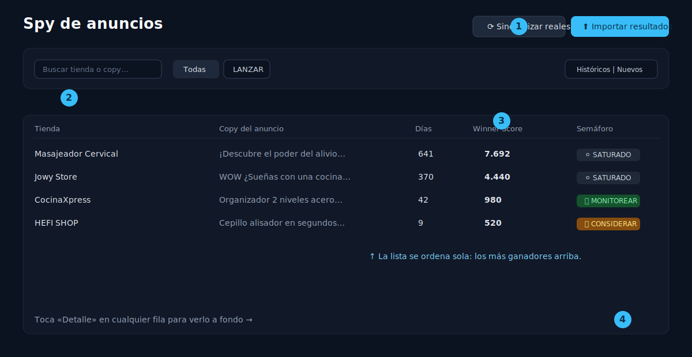

# 📘 Guía de WinSpy
### Cómo usar la plataforma, explicado para cualquier persona (sin saber de tecnología)

---

## 👋 Empieza por aquí

WinSpy es una herramienta para **encontrar productos que se venden mucho, copiar la idea bien hecha y armar la página para venderlos**. Piénsalo como tres ayudantes que trabajan para ti:

| | Ayudante | Qué hace por ti |
|---|---|---|
| 🔎 | **El espía** | Mira la publicidad de otras tiendas y te dice qué productos están funcionando. |
| 🎨 | **El diseñador** | Crea, con inteligencia artificial, las 9 imágenes de la página de ventas. |
| 📊 | **El organizador** | Lleva la cuenta de cada producto: desde que lo descubres hasta que lo vendes. |

> 💡 **No necesitas instalar nada.** WinSpy se abre en el navegador (Chrome), como cuando entras a tu correo o a Facebook.

---

## 🔑 1. Entrar a la plataforma

1. Abre el navegador y entra a la dirección de WinSpy (tu enlace de siempre).
2. Escribe tu **correo** y tu **contraseña**.
3. Pulsa **Entrar**.

> ✅ **¿Por qué pide contraseña?** Para que solo tú y tu socio vean la información del negocio. Si te equivocas muchas veces, te bloquea un rato por seguridad: espera unos minutos y vuelve a intentar.

---

## 🗺️ 2. El menú: tu mapa dentro de la app

A la izquierda siempre tienes el menú. Esto es lo que hay en cada botón:

> 🟦 **Si te pierdes, vuelve siempre al menú de la izquierda.** Es el mismo en todas las pantallas.

---

## 🔎 3. Encontrar productos ganadores (Spy de anuncios)

Esta es **la pantalla con la que más vas a trabajar**. Aquí aparece la publicidad que están corriendo otras tiendas, ordenada de mejor a peor.

### Qué haces y por qué

| Paso | Qué haces | Por qué |
|---|---|---|
| ① | Pulsas **Sincronizar reales** o **Importar resultados** | Trae anuncios nuevos. “Sincronizar” los busca solo; “Importar” es para pegar una lista que ya tengas. |
| ② | Usas los **filtros** (buscar, color del semáforo, días activos) | Para no perderte entre cientos de anuncios y ver solo lo que te interesa. |
| ③ | Miras la columna **Winner Score** | Es la “nota” del producto. **Mientras más alto, más fuerte la señal de que vende.** |
| ④ | Pulsas **Detalle** en una fila | Para verlo a fondo y decidir si lo trabajas. |

### 🚦 El semáforo: cómo leer la “nota” de un golpe

Cada anuncio recibe un color automáticamente. No tienes que calcular nada:

> 💡 **Truco:** empieza siempre mirando los **🔴 rojos** y **🟡 amarillos** de arriba. Son los que más vale la pena revisar.

> ℹ️ **¿Y si el “gasto” aparece como “—”?** Es normal: Facebook no muestra el gasto de muchos anuncios en Colombia. Cuando pasa eso, WinSpy usa los **días activos** como pista (un anuncio que lleva mucho tiempo corriendo suele ser porque le funciona).

---

## 🔬 4. Mirar un anuncio a fondo (y convertirlo en producto)

Cuando entras al **Detalle** de un anuncio ves: el texto del anuncio, su imagen o video, el enlace al anuncio real y desde cuándo está corriendo.

### Lo más útil de esta pantalla

| Qué haces | Por qué |
|---|---|
| Pulsas **✨ Sugerir con IA** | La inteligencia artificial lee el anuncio y te propone, sola, el **nombre, la descripción, el público y el ángulo de venta**. Te ahorra escribir todo. |
| Marcas las **señales** (se vende en CO, etc.) | Para recordar lo que ya sabes de ese producto. |
| Pulsas **Crear producto desde este anuncio** | Guardas el producto en tu lista para empezar a trabajarlo. |

> ✅ **Por qué esto importa:** en un clic pasas de “vi un anuncio interesante” a “tengo una ficha de producto lista”, sin escribir nada a mano.

---

## 📦 5. Gestionar el producto (el “pipeline”)

Cada producto que creas tiene su propia ficha. Ahí decides en qué etapa va, con un menú sencillo:

> **Detectado → Validado → Landing creada → Lanzado → Escalando**

| Qué haces | Por qué |
|---|---|
| Cambias la **etapa** | Para saber, de un vistazo, en qué punto está cada producto. |
| Eliges la **disponibilidad en Dropi** (Disponible / A importar…) | Para saber si lo puedes conseguir fácil o toca importarlo. |
| Escribes **notas** | Para no olvidar detalles (proveedor, margen, ideas…). |
| Pulsas **Nueva landing** | Para crear su página de ventas (siguiente paso). |

> 💡 También puedes crear un producto **a mano** con el botón **“Nuevo producto”** (arriba a la derecha en la pantalla Productos), por si no viene de un anuncio.

---

## 🎨 6. Crear la página de ventas (landing con 9 imágenes)

Aquí la IA te arma las **9 imágenes** típicas de una página de ventas, con el texto en español. Es un asistente de **3 pasos**:

### Detalle de cada paso

| Paso | Qué haces | Por qué |
|---|---|---|
| **1. Datos** | Escribes producto, precios, público y ángulo. O pulsas **✨ Autocompletar con IA** | El autocompletar te llena casi todo solo, con buenas palabras de venta. |
| **2. Estilo** | (Opcional) subes una **foto del producto** y una **imagen de referencia** de estilo | Para que las imágenes se parezcan a tu producto y tengan el estilo que te gusta. |
| **3. Generar** | Revisas el resumen y pulsas **✨ Generar 9 imágenes** | Manda a la IA a trabajar. Tú no tienes que diseñar nada. |

> 🔘 **¿Qué es “Compliance TikTok”?** Si lo activas, la IA evita frases que TikTok no permite (promesas médicas, “bajar de peso”, “100% garantizado”). Actívalo si vas a anunciar en TikTok.

### El resultado

Tarda 1–2 minutos (verás una barra de progreso). Cuando termina, ves las 9 imágenes:

| Qué haces | Por qué |
|---|---|
| **Descargar .zip** | Bajas todas las imágenes juntas, listas para subir a tu tienda (Shopify). |
| Ícono **⟳** en una imagen | Si una no te convence, la **regeneras sola**, sin tocar las otras. |

> 💡 Si alguna imagen sale con una palabra mal escrita (a veces la IA se equivoca al “dibujar” letras), simplemente regenérala con el botón ⟳.

---

## 📊 7. El Dashboard (tu tablero de control)

Es la pantalla de inicio. De un vistazo te dice cómo va el negocio:

| Número | Qué significa |
|---|---|
| **Anuncios detectados** | Cuántos anuncios tienes guardados (y cuántos son nuevos). |
| **En análisis / Lanzados** | Cuántos productos estás evaluando y cuántos ya vendiendo. |
| **Landings generadas** | Cuántas páginas de venta has creado. |
| **Tiendas monitoreadas** | A cuántos competidores les sigues la pista. |
| **Pipeline** | El camino visual de tus productos (Detectado → … → Escalando). |
| **Top 5** | Los 5 productos con mejor nota ahora mismo (verás el score y los días activos). |

---

## 🏬 8. Tiendas, ⚙️ Ajustes y 💲 Costos

| Pantalla | Para qué sirve |
|---|---|
| **Tiendas** | Agregar o quitar las tiendas competidoras que quieres vigilar. |
| **Ajustes** | Cambiar las reglas del semáforo (avanzado). Al guardar, recolorea todos los anuncios. **Si no sabes, déjalo como está.** |
| **Costos** | Ver cuánto cuesta cada acción (traer anuncios, generar imágenes, etc.) en pesos y dólares, y cuánto llevas gastado. |

---

## ❓ 9. Preguntas frecuentes

**No aparecen anuncios nuevos.**
Pulsa **Sincronizar reales** y espera ~30–60 segundos; luego recarga la página.

**La landing se queda “en cola” y no avanza.**
Espera un par de minutos (la IA está trabajando). Si pasa mucho tiempo, avisa a quien administra el sistema.

**Una imagen salió con una falta de ortografía.**
Toca el botón ⟳ de esa imagen para regenerarla.

**Me bloqueó el inicio de sesión.**
Es la protección por demasiados intentos. Espera unos minutos y vuelve a entrar.

**¿Esto espía Facebook automáticamente?**
No directamente: WinSpy **recibe y organiza** los anuncios; la búsqueda en vivo la hace una herramienta aparte. Tú solo trabajas con la lista ya organizada.

---

## 📖 10. Glosario rápido

| Palabra | En cristiano |
|---|---|
| **Landing** | La página donde la gente ve el producto y compra. |
| **Creativo** | La imagen o video del anuncio. |
| **Winner Score** | La “nota” del producto: más alto = mejor señal. |
| **Dropi** | La plataforma de donde se saca/envía la mercancía. |
| **Pipeline** | El recorrido del producto, de la idea a la venta. |
| **Compliance** | Cumplir las reglas de la red social (que no te tumben el anuncio). |
| **CO** | Colombia (el país del anuncio). |

---

### 🚀 El día a día en 3 pasos
**🔎 Spy** (caza un ganador) → **📦 Producto** (lo guardas) → **🎨 Landing** (página lista para vender)

---

> 🖼️ *Nota para quien mantiene el repo: las ilustraciones están en `docs/img/` (formato `.svg`, se ven solas en GitHub). Si quieres reemplazarlas por **capturas reales** de la app, guarda las fotos con los mismos nombres (`00-portada`, `01-menu`, `02-semaforo`, `03-spy`, `04-landing-flujo`, `05-landing-resultado`) y actualiza las extensiones aquí.*
