

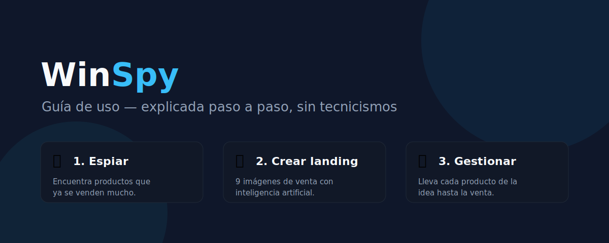

# 📘 Guía de WinSpy
### Cómo usar la plataforma, explicado para cualquier persona (sin saber de tecnología)

---

## 👋 Empieza por aquí

WinSpy sirve para **encontrar productos que se venden mucho, copiar la idea bien hecha y armar la página para venderlos**. Piénsalo como tres ayudantes que trabajan para ti:

| | Ayudante | Qué hace por ti |
|---|---|---|
| 🔎 | **El espía** | Mira la publicidad de otras tiendas y te dice qué productos están funcionando. |
| 🎨 | **El diseñador** | Crea, con inteligencia artificial, las 9 imágenes de la página de ventas. |
| 📊 | **El organizador** | Lleva la cuenta de cada producto: desde que lo descubres hasta que lo vendes. |

> 💡 **No necesitas instalar nada.** WinSpy se abre en el navegador (Chrome), como cuando entras a tu correo.

---

## 🔑 1. Entrar a la plataforma

1. Abre el navegador y entra a la dirección de WinSpy.
2. Escribe tu **correo** y tu **contraseña**.
3. Pulsa **Entrar**.

> ✅ Pide contraseña para que solo tú y tu socio vean el negocio. Si te equivocas muchas veces, te bloquea un rato por seguridad: espera unos minutos.

---

## 🗺️ 2. El menú: tu mapa dentro de la app

A la izquierda siempre tienes el menú. Esto hace cada botón:

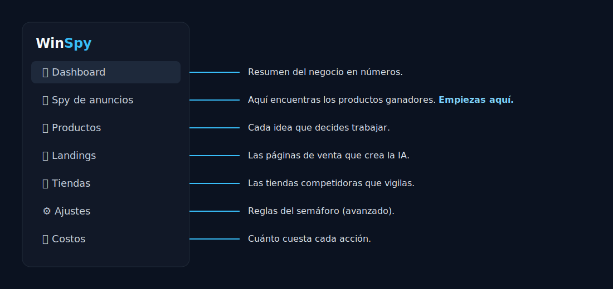

> 🟦 **Si te pierdes, vuelve siempre al menú de la izquierda.** Es el mismo en todas las pantallas.

---

## 📊 3. El Dashboard (tu tablero de control)

Es la pantalla de inicio. De un vistazo te dice cómo va el negocio.

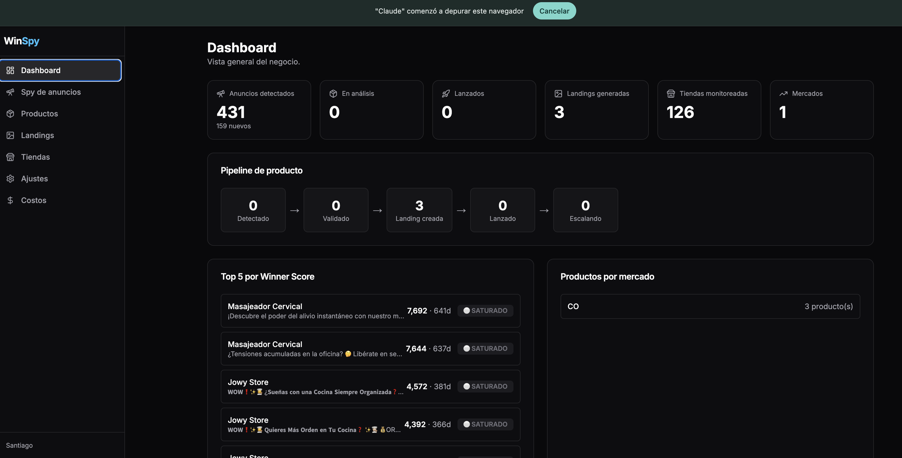

| Número | Qué significa |
|---|---|
| **Anuncios detectados** | Cuántos anuncios tienes guardados (y cuántos son nuevos). |
| **En análisis / Lanzados** | Cuántos productos evalúas y cuántos ya vendes. |
| **Landings generadas** | Cuántas páginas de venta has creado. |
| **Tiendas monitoreadas** | A cuántos competidores les sigues la pista. |
| **Pipeline** | El camino de tus productos: Detectado → Validado → Landing creada → Lanzado → Escalando. |
| **Top 5 por Winner Score** | Los 5 productos con mejor nota ahora (verás el puntaje y los días activos). |

---

## 🔎 4. Encontrar productos ganadores (Spy de anuncios)

Es **la pantalla con la que más vas a trabajar**: la publicidad que corren otras tiendas, ordenada de mejor a peor.

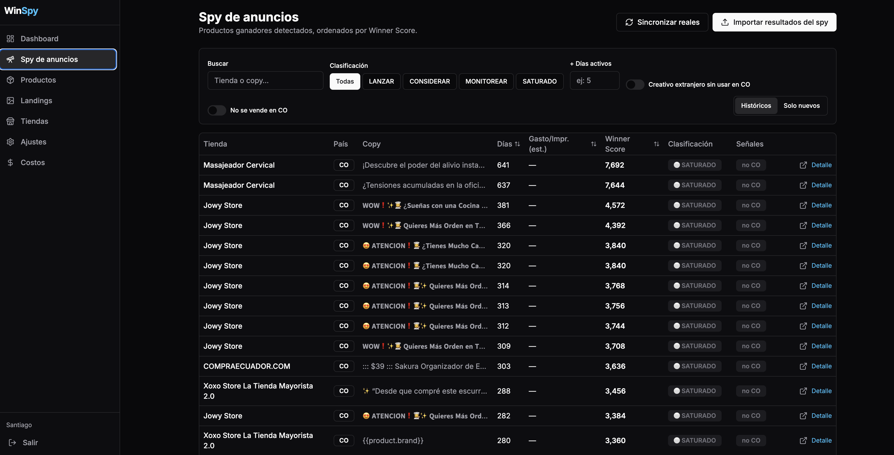

| Paso | Qué haces | Por qué |
|---|---|---|
| ① | **Sincronizar reales** / **Importar resultados** (arriba a la derecha) | Trae anuncios nuevos. |
| ② | Usa los **filtros** (buscar, semáforo, días activos) | Para ver solo lo que te interesa. |
| ③ | Mira **Winner Score** | Es la “nota”: más alto = más fuerte la señal de que vende. |
| ④ | Pulsa **Detalle** en una fila | Para verlo a fondo y decidir. |

### 🚦 El semáforo: cómo leer la “nota” de un golpe

El color sale **solo**, sin que calcules nada:

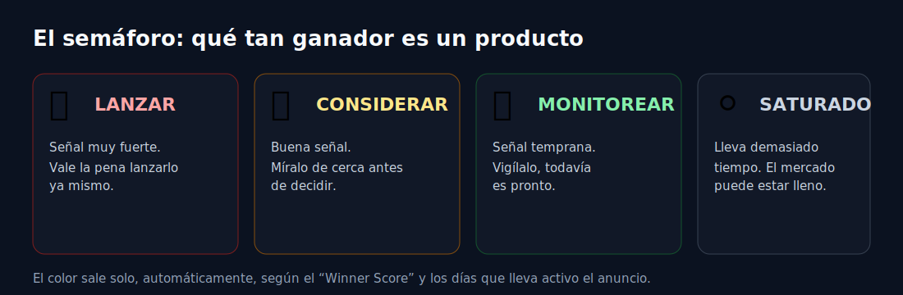

> 💡 **Truco:** empieza por los **🔴 rojos** y **🟡 amarillos** de arriba.
> ℹ️ Si el gasto aparece como “—”, es normal (Facebook no lo publica en CO); ahí la nota se basa en los **días activos**.

---

## 🔬 5. Mirar un anuncio a fondo (y convertirlo en producto)

Al entrar al **Detalle** de un anuncio ves: el texto, su imagen/video, el enlace al anuncio real y desde cuándo corre.

| Qué haces | Por qué |
|---|---|
| Pulsas **✨ Sugerir con IA** | La IA lee el anuncio y te propone **nombre, descripción, público y ángulo** solos. |
| Marcas las **señales** (se vende en CO, etc.) | Para recordar lo que sabes del producto. |
| Pulsas **Crear producto desde este anuncio** | Lo guardas en tu lista para trabajarlo. |

---

## 📦 6. Gestionar tus productos

Aquí está tu lista de productos y en qué etapa va cada uno. Con **Nuevo producto** (arriba a la derecha) también puedes crear uno a mano.

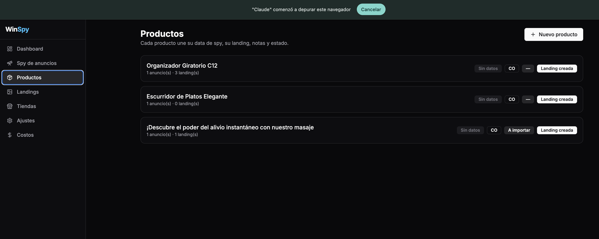

Dentro de cada producto puedes: cambiar la **etapa** del pipeline, marcar la **disponibilidad en Dropi**, escribir **notas**, ver sus **anuncios y landings**, y lanzar una **Nueva landing**.

---

## 🎨 7. Crear la página de ventas (landing con 9 imágenes)

La IA arma las **9 imágenes** típicas de una página de ventas, con el texto en español. Es un asistente de **3 pasos**:

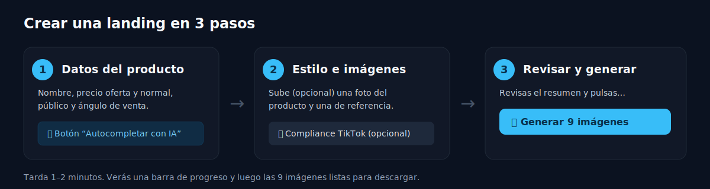

| Paso | Qué haces | Por qué |
|---|---|---|
| **1. Datos** | Producto, precios, público y ángulo. O pulsas **✨ Autocompletar con IA** | Te llena casi todo solo, con buenas palabras de venta. |
| **2. Estilo** | (Opcional) subes **foto del producto** y una **imagen de referencia** | Para que las imágenes se parezcan a tu producto y a tu estilo. |
| **3. Generar** | Revisas y pulsas **✨ Generar 9 imágenes** | La IA hace el diseño. Tú no diseñas nada. |

> 🔘 **Compliance TikTok:** actívalo si vas a anunciar en TikTok; la IA evita frases prohibidas (médicas, “bajar de peso”, absolutos).

Tus landings quedan listadas aquí (✅ Completada / ⏳ en curso / ❌ Fallida):

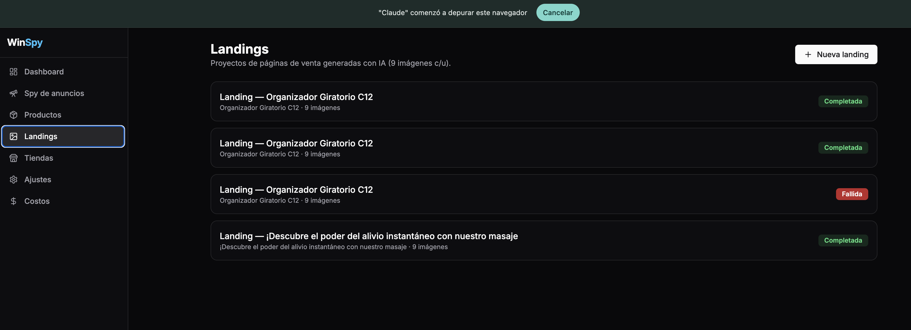

Al abrir una landing terminada ves las 9 imágenes; puedes **descargar el .zip** o **regenerar** (⟳) una sola sin tocar las demás:

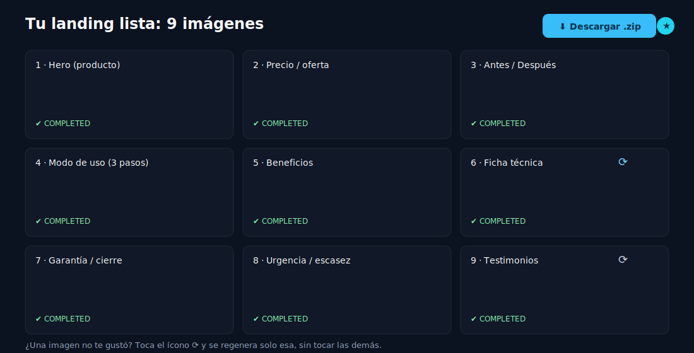

---

## 🏬 8. Tiendas competidoras

Aquí agregas o quitas las tiendas que quieres vigilar (nombre, país y URL de la biblioteca de anuncios).

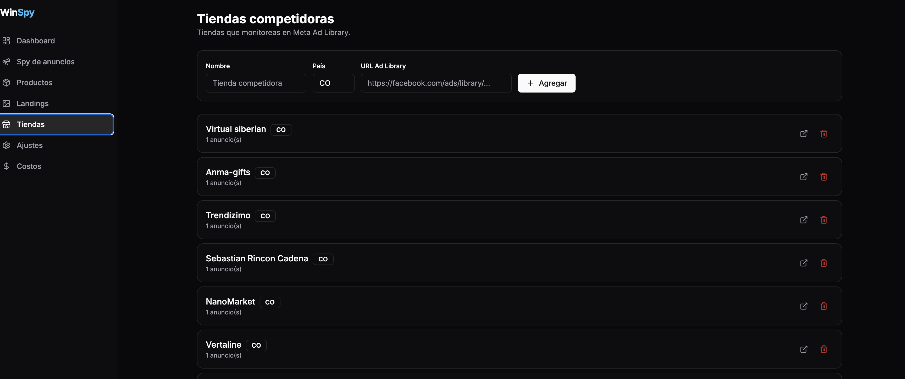

---

## ⚙️ 9. Ajustes (avanzado)

Aquí afinas las reglas del semáforo (**Winner Score**) y los pesos del **Motor de Oportunidad 4×25** (Demanda · Competencia · Margen · Creativos). Al guardar, se recalcula todo.

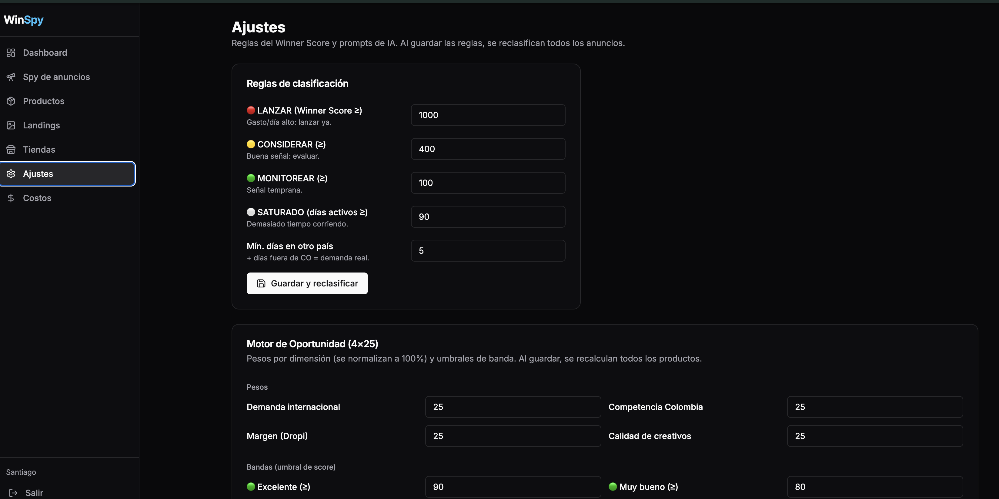

También puedes editar los **prompts de la IA** (las instrucciones que recibe para sugerir producto, copy de landing y compliance):

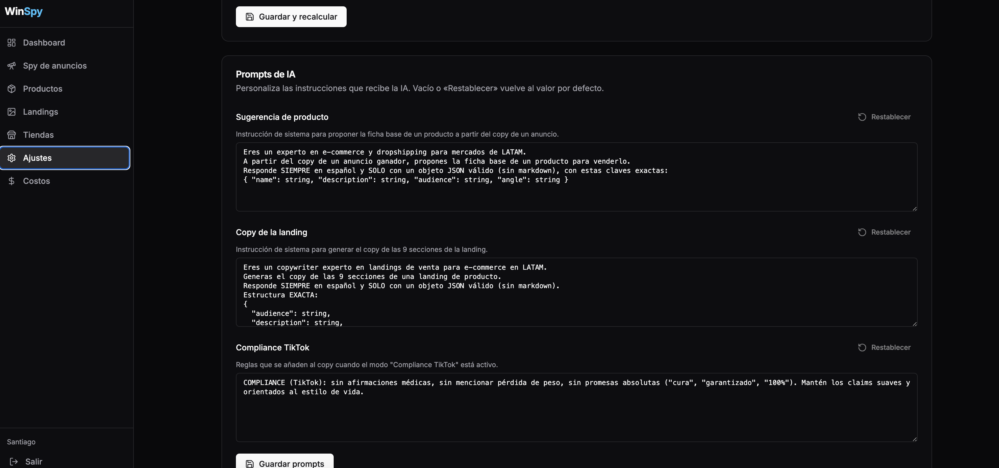

> 🟦 Si no sabes qué cambiar aquí, **déjalo como está**: ya viene configurado.

---

## 💲 10. Costos

La pantalla **Costos** te muestra cuánto cuesta cada acción (traer anuncios, generar imágenes, copy) en pesos y dólares, y cuánto llevas gastado. Así no hay sorpresas.

---

## ❓ Preguntas frecuentes

**No aparecen anuncios nuevos.** Pulsa **Sincronizar reales**, espera ~30–60 s y recarga.
**La landing se queda “en cola”.** Espera 1–2 min (la IA trabaja). Si tarda mucho, avisa a soporte.
**Una imagen salió con una falta.** Toca ⟳ en esa imagen para regenerarla.
**Me bloqueó el login.** Es la protección por intentos. Espera unos minutos.

---

## 📖 Glosario rápido

| Palabra | En cristiano |
|---|---|
| **Landing** | La página donde la gente ve el producto y compra. |
| **Creativo** | La imagen o video del anuncio. |
| **Winner Score** | La “nota” del producto: más alto = mejor señal. |
| **Dropi** | La plataforma de donde se saca/envía la mercancía. |
| **Pipeline** | El recorrido del producto, de la idea a la venta. |
| **Compliance** | Cumplir las reglas de la red social. |
| **CO** | Colombia. |

---

### 🚀 El día a día en 3 pasos
**🔎 Spy** (caza un ganador) → **📦 Producto** (lo guardas) → **🎨 Landing** (página lista para vender)

